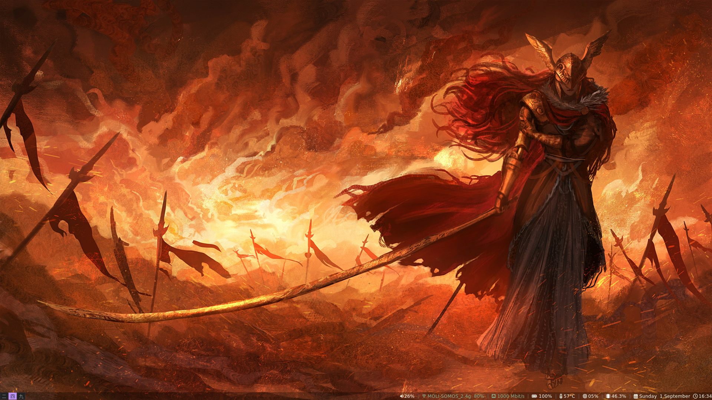
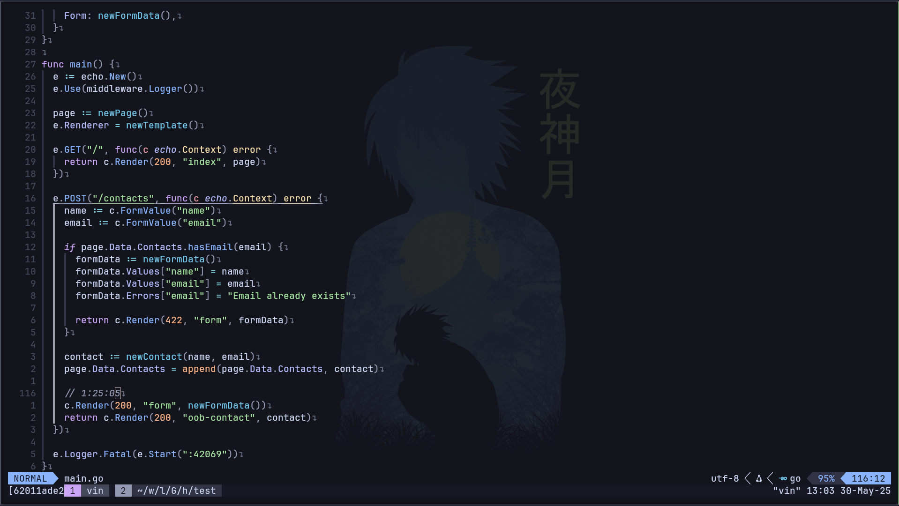
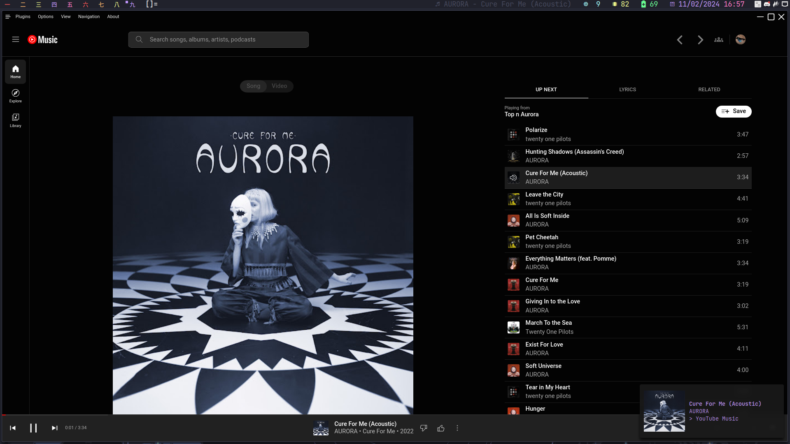
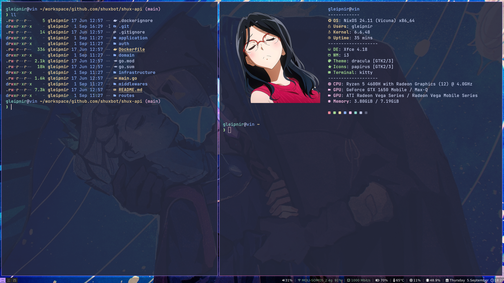

# Dotfiles

|                                              |                                         |
| -------------------------------------------- | --------------------------------------- |
|  |       |
|    |  |

## Stuff

|                     |                                                                                                                                                                                                    |
| ------------------- | -------------------------------------------------------------------------------------------------------------------------------------------------------------------------------------------------- |
| Fonts               | [JetBrainsMono Nerd Font](https://www.programmingfonts.org/#jetbrainsmono) - [Noto Sans JP](https://fonts.google.com/noto/specimen/Noto+Sans+JP)                                                   |
| Editor              | [neovim](https://neovim.io/)                                                                                                                                                                       |
| File Manager        | [yazi](https://yazi-rs.github.io/)                                                                                                                                                                 |
| Terminal Emulator   | [kitty](https://sw.kovidgoyal.net/kitty/)                                                                                                                                                          |
| Web Browser         | [Zen](https://zen-browser.app/)                                                                                                                                                                    |
| Window Manager      | [i3](https://i3wm.org/)                                                                                                                                                                            |
| Desktop Environment | [xfce](https://www.xfce.org/)                                                                                                                                                                      |
| Images              | [feh](https://feh.finalrewind.org/)                                                                                                                                                                |
| Audio               | [pulseaudio](https://www.freedesktop.org/wiki/Software/PulseAudio/) - [pavucontrol](https://freedesktop.org/software/pulseaudio/pavucontrol/) - [yt-music](https://github.com/th-ch/youtube-music) |
