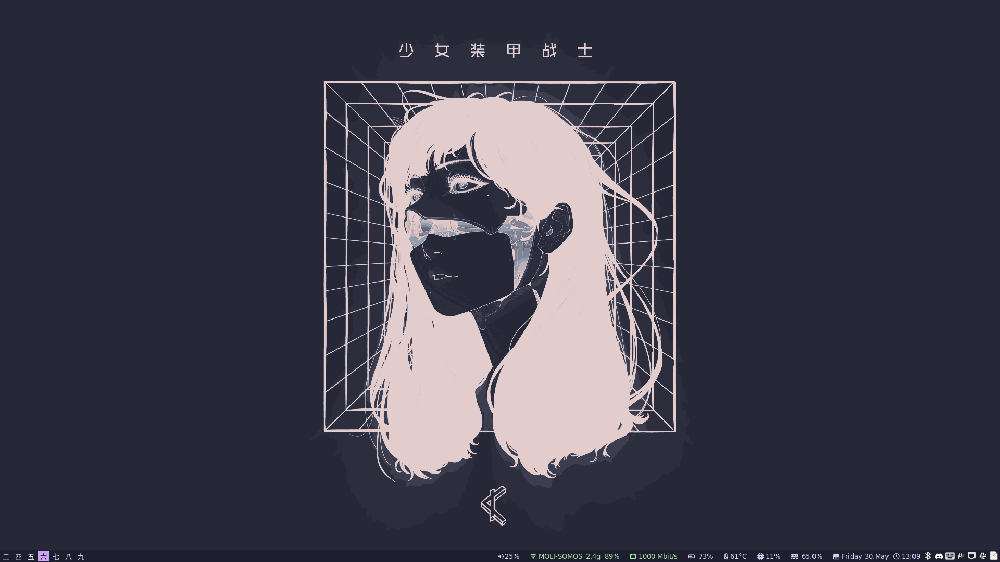
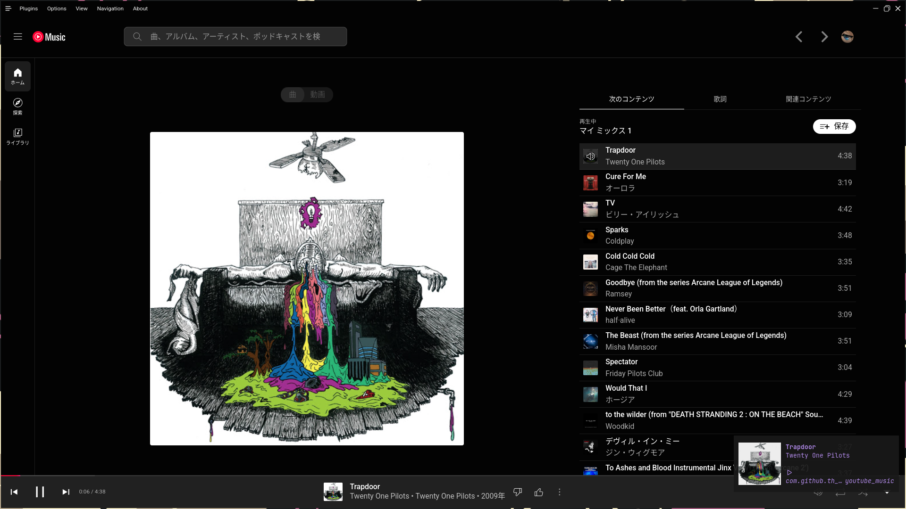
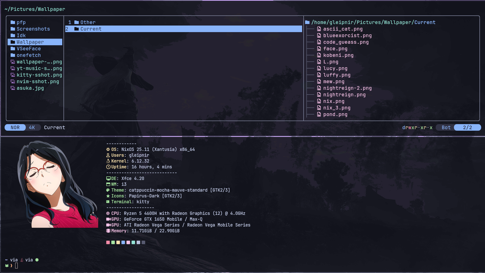

# Dotfiles
|                                              |                                         |
|----------------------------------------------|-----------------------------------------|
|  |       |
|    |  |

## Stuff
|||
| -----------		| ----------- |
| Fonts				| [JetBrainsMono Nerd Font](https://www.programmingfonts.org/#jetbrainsmono) [Noto Sans JP](https://fonts.google.com/noto/specimen/Noto+Sans+JP) |
| Editor			| [nvim](https://neovim.io/) |
| File Manager		| [pcmanfm](https://github.com/lxde/pcmanfm) |
| Terminal Emulator	| [kitty](https://sw.kovidgoyal.net/kitty/) |
| Web Browser		| [chromium](https://www.chromium.org/chromium-projects/) |
| AUR Helper		| [pikaur](https://github.com/actionless/pikaur) |
| Window Manager	| [dwm](https://dwm.suckless.org/) |
| Status monitor	| [slstatus](https://tools.suckless.org/slstatus/) |
| Images			| [feh](https://feh.finalrewind.org/)       |
| Audio				| [pulseaudio](https://www.freedesktop.org/wiki/Software/PulseAudio/) - [pavucontrol](https://freedesktop.org/software/pulseaudio/pavucontrol/) -  [yt-music](https://github.com/th-ch/youtube-music)|

